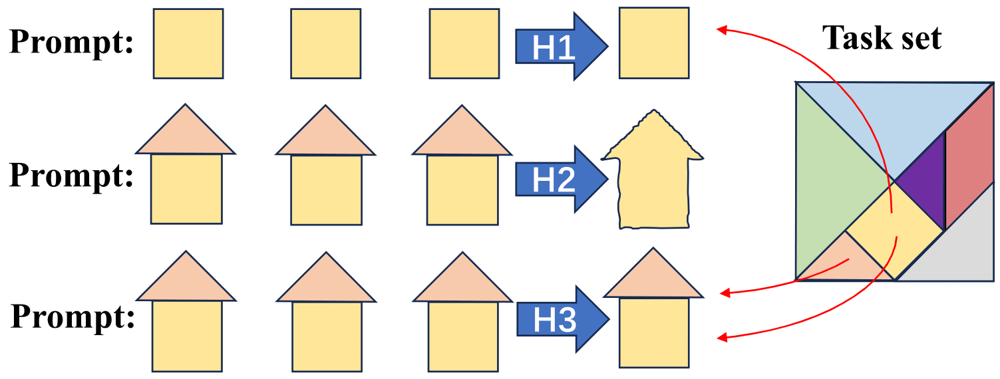
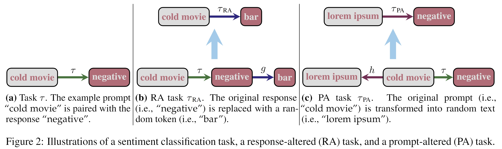

# ICL Explanation

[]()
[]([https://arxiv.org/abs/2310.14491](https://arxiv.org/abs/2406.04216))


##### Source code for **[What Do Language Models Learn in Context? The Structured Task Hypothesis](https://arxiv.org/abs/2310.14491)**


---



> Large language models (LLMs) exhibit an intriguing ability to learn a novel task from in-context examples presented in a demonstration, termed in-context learning (ICL). Understandably, a swath of research has been dedicated to uncovering the theories underpinning ICL.
>> 1. One popular hypothesis explains ICL by task selection. LLMs identify the task based on the demonstration and generalize it to the prompt.
>> 2. Another popular hypothesis is that ICL is a form of meta-learning, i.e., the models learn a learning algorithm at pre-training time and apply it to the demonstration.
>> 3. Finally, a third hypothesis argues that LLMs use the demonstration to select a composition of tasks learned during pre-training to perform ICL.


---



> In this paper, we empirically explore these three hypotheses that explain LLMs’ ability to learn in context with a suite of experiments derived from common text classification tasks. We invalidate the first two hypotheses with counterexamples and provide evidence in support of the last hypothesis. Our results suggest an LLM could learn a novel task in context via composing tasks learned during pre-training.

---

## Try ICL

### 1. Prepare the environment

Install necessary libraries:

    $ pip install -r requirements.txt

### 2. Prepare the model (name or path)

Download LLMs e.g., LLaMA-2 (we support all three sizes, please provide 2 A100-80G for LLaMA-70B):

### 3. Run the code

Run our code for ICL evaluation (make sure the internet is accessible):

    $ python src/main.py --model_path meta-llama/Llama-2-7b-hf --dataset SetFit/sst2 --icl_num 32 --test_num 256 --repeat_num 20

Note that for each time, we will train a linear classifier to perform the task as well to show if it's learnable or not.

## Other analysis experiments

We have also prepared code for other analysis experiments. Check our code (*task_pattern*) for more details.

> 1. **task_pattern="none"**: Original ICL without any modification; 
>
> 2. **task_pattern="label"**: RA-task, where the label is changed to random tokens;
>
> 3. **task_pattern="token"**: PA-task, where the prompt (as well as template) is changed to random tokens;
>
> 4. **task_pattern="memo_label_rand"**: the prompt is the original label while the response is a random token;
>
> 5. **task_pattern="memo_label_kw"**: the prompt is the original label while the response is the keyword token;
>
> 6. **task_pattern="memo_label_syn"**: the prompt is the original label while the response is the synonym token;
>
> 7. **task_pattern="memo_label_ant"**: the prompt is the original label while the response is the antonym token;

---

### Cite

If this work/code is helpful for you, welcome to cite our paper:

```
@misc{li2024language,
      title={What Do Language Models Learn in Context? The Structured Task Hypothesis}, 
      author={Jiaoda Li and Yifan Hou and Mrinmaya Sachan and Ryan Cotterell},
      year={2024},
      eprint={2406.04216},
      archivePrefix={arXiv},
      primaryClass={cs.CL}
}
```
---

### Contact

Feel free to open an issue or send me (yifan.hou@inf.ethz.ch) an email if you have any questions!
